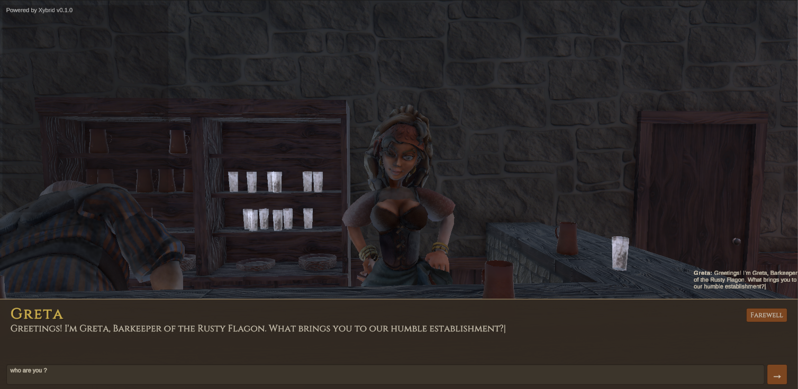
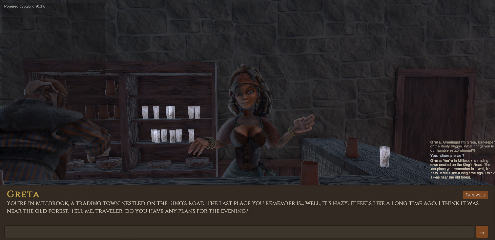
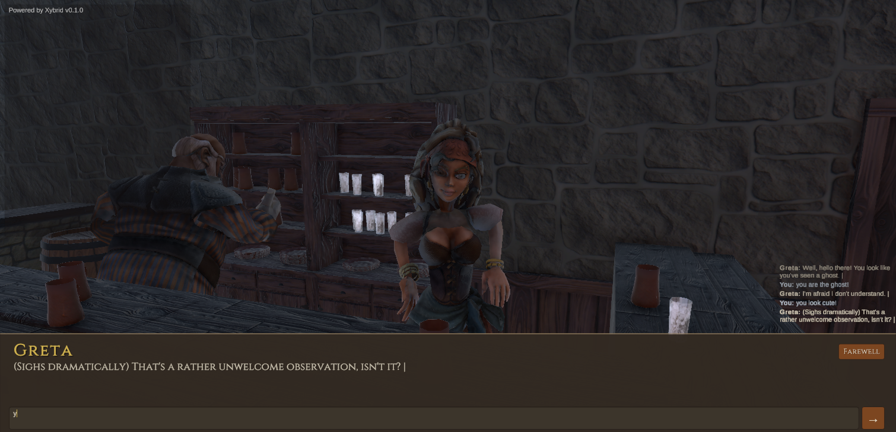

# Night Tavern - Xybrid Unity Example

A full RPG example project demonstrating Xybrid SDK integration with Unity. Features immersive NPC dialogue powered by AI and text-to-speech audio for dynamic character interactions.

## Download

Get the latest release from [GitHub Releases](https://github.com/xybrid-ai/xybrid-unity-tavern/releases).

Each release includes a complete Unity project zip ready to import.

## Requirements

- **Unity 2022.3 LTS** (or later)
- **Xybrid SDK** - [Get it here](https://github.com/xybrid-ai/xybrid)

## Installation

### 1. Download the project

Download the latest release zip from [GitHub Releases](https://github.com/xybrid-ai/xybrid-unity-tavern/releases) and extract it to your Unity projects folder.

### 2. Open in Unity

Open Unity Hub, click **Add**, and select the extracted project folder. Open it with Unity 2022.3 LTS or later.

### 3. Install the Xybrid SDK

If the Xybrid SDK package is not already included in the project:

1. Download the SDK from [github.com/xybrid-ai/xybrid](https://github.com/xybrid-ai/xybrid)
2. In Unity, go to **Assets > Import Package > Custom Package**
3. Select the downloaded Xybrid SDK package and import all assets

### 4. Open the scene and play

1. In the Project panel, navigate to `Assets/Scenes/`
2. Open the `Tavern` scene
3. Press **Play** to start interacting with NPCs

## Features

- **AI-Powered NPC Dialogue** - Dynamic conversations that respond intelligently to player input
- **Text-to-Speech Audio** - Characters speak with synthesized voices for immersive interactions
- **RPG Tavern Setting** - Atmospheric medieval tavern environment
- **Multiple NPCs** - Interact with various characters, each with unique personalities

## Screenshots

| | |
|---|---|
| [](docs/screenshots/npc-greeting.png) | [](docs/screenshots/npc-conversation.png) |
| [](docs/screenshots/npc-greeting-2.png) | [](docs/screenshots/npc-conversation-2.png) |

*Talk to NPCs like Greta the barkeeper — each character responds dynamically using on-device AI.*

## Project Structure

```
Assets/
├── Scenes/          # Game scenes
├── Scripts/         # C# scripts for NPC and dialogue systems
├── Audio/           # TTS audio files and sound effects
├── Prefabs/         # Character and environment prefabs
└── Materials/       # Visual materials and textures
```

## Documentation

See the [docs/](docs/) folder for additional documentation.

## Related

- [Xybrid SDK](https://github.com/xybrid-ai/xybrid) - Main Xybrid repository
- [Xybrid Documentation](https://github.com/xybrid-ai/xybrid#readme) - SDK documentation and guides

## License

This project is licensed under the MIT License - see the [LICENSE](LICENSE) file for details.
